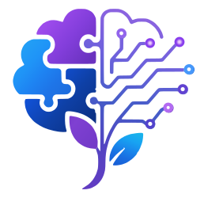

<div align="center">



# Smaran

Offline-first cognitive support for elderly people living with dementia in India's
North Eastern Region — a patient app, a caregiver dashboard, and the sync backend
between them.

Built for Smart India Hackathon problem **SIH26003** (MDoNER).

</div>

---

## Overview

**Smaran** ("to remember") is a monorepo with three deployables:

- **`apps/mobile`** — the patient app. An offline-first Expo (React Native) app the
  person with dementia uses directly: adaptive cognitive games built from their own
  family and memories, medicine/hydration/activity reminders, and a photo gallery of
  the people and places they know. Every core screen works with the network off —
  the network exists only to sync already-captured data, never to gate a feature.
- **`apps/web`** — the caregiver dashboard. A Next.js app the family member or carer
  uses to set up reminders and memory subjects, and to see progress and AI-assisted
  insights — always compared against the patient's *own* history, never a
  population average.
- **`apps/api`** — the FastAPI backend that authenticates both apps, stores what
  syncs, generates recognition questions, and serves the dashboard's analytics.

The person holding the phone has dementia. Every design decision in `apps/mobile`
follows from that one fact — see `AGENTS.md` for the full set of constraints this
project holds itself to.

---

## Getting Started

### Prerequisites

- **bun** — JavaScript runtime and package manager
- **uv** — Python project manager
- **tmux** — terminal multiplexer, used by the dev dashboard
- **task** — task runner (an alternative to `make`)

### Installation

1. **bun**
    - Linux & macOS: `curl -fsSL https://bun.sh/install | bash`
    - Windows: `powershell -c "irm bun.sh/install.ps1|iex"`
    [See more](https://bun.sh/docs/quickstart)

2. **uv**
    - Linux & macOS: `curl -LsSf https://astral.sh/uv/install.sh | sh`
    - Windows: `powershell -ExecutionPolicy ByPass -c "irm https://astral.sh/uv/install.ps1 | iex"`
    [See more](https://docs.astral.sh/uv/getting-started/installation/)

3. **tmux**
    - Linux & macOS: available on most package managers
    - Windows: not natively available ([psmux](https://github.com/psmux/psmux#installation) is an alternative)
    [See more](https://github.com/tmux/tmux/wiki/Installing) · [Key bindings](https://tmuxcheatsheet.com/)

4. **task**
    - Universal: `npm install -g @go-task/cli`
    - winget: `winget install Task.Task`
    *`task` is available on every major package manager — see the
    [installation docs](https://taskfile.dev/docs/installation).*

Then, from the repo root:

```bash
task setup        # installs JS deps (bun) and Python deps (uv) for every app
```

---

## Taskfile Commands

Every dev command is defined in `Taskfile.yml` — run `task --list` for the full
set. The ones you'll actually reach for day to day:

| Command | What it does |
|---|---|
| `task setup` | Install dependencies for all three apps |
| `task dev:all` | Start the API, web, and mobile dev servers, each in its own tmux window |
| `task dev:split` | Start the same three servers tiled in one tmux window |
| `task dev:api` | Start only the FastAPI backend (`:8080`) |
| `task dev:web` | Start only the caregiver dashboard (`:3000`) |
| `task dev:mobile` | Start only the Expo dev server for the patient app |
| `task stop` | Kill the tmux dev session |
| `task db:migrate` | Apply pending Alembic migrations to the database in `apps/api/.env` |

`task dev:web+api` and `task dev:mobile+api` are also available when you only
need two of the three servers running side by side.

---

## How It Fits Together

```
   patient's phone                   family member / carer
  ┌─────────────────┐               ┌──────────────────────┐
  │   apps/mobile    │               │       apps/web        │
  │  (Expo, offline) │               │  (Next.js dashboard)  │
  └────────┬─────────┘               └───────────┬───────────┘
           │  syncs when it can                   │  always online
           └───────────────┬──────────────────────┘
                            │
                     ┌──────▼──────┐
                     │  apps/api   │
                     │  (FastAPI)  │
                     └─────────────┘
```

1. **The caregiver signs up** on the web dashboard and claims the caregiver role.
2. **The patient signs in once** on the phone (Clerk hosted auth) and stays signed
   in — they are never asked to authenticate again.
3. **Linking the two**: the phone shows a nine-digit Smaran id. The reader (or
   whoever is setting the phone up for them) gives that id to their caregiver, who
   accepts the resulting request on the dashboard. From then on the two accounts
   are linked.
4. **Day to day, the patient app needs no network at all.** Games, reminders, and
   the memory gallery all read and write to on-device storage. When a connection
   is available — on app open, or when the caregiver adds something new — the app
   syncs: game results and reminder outcomes go up, and reminders or memory photos
   the caregiver has added come down.
5. **The caregiver dashboard is a normal web app** — sign in, see linked patients,
   set up reminders and memory subjects, and review progress, trends, and
   AI-assisted insights, all compared against that one patient's own history.

---

## Documentation

- [`docs/git_guidelines.md`](docs/git_guidelines.md) — commit conventions, branching, and staying in sync
- [`docs/api-endpoints.md`](docs/api-endpoints.md) — overview of every backend endpoint
- `AGENTS.md` — the operating manual for this codebase, including the accessibility and
  offline-first rules every screen must follow
- `artifacts/` — the living knowledge base: what's actually built, architecture, and
  decisions already made

---

## Credits

